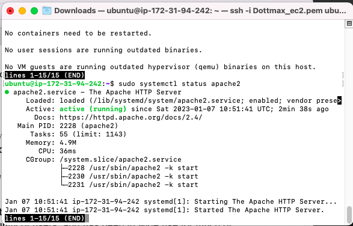
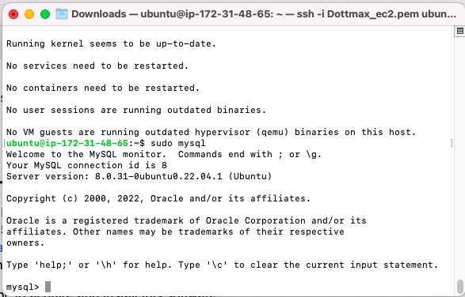
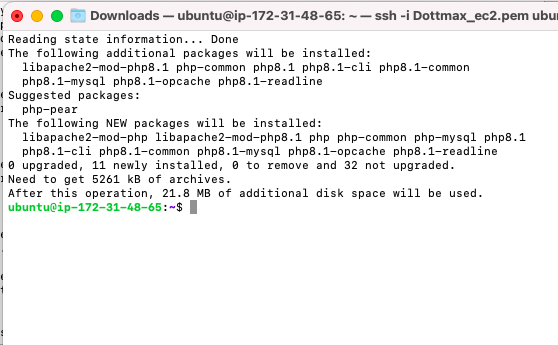
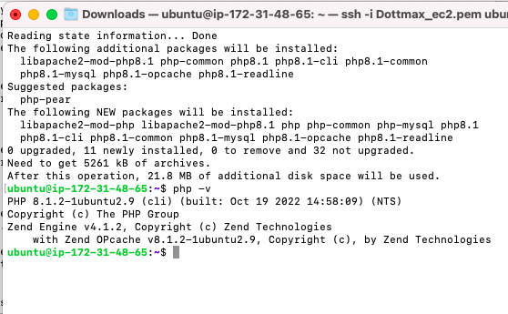

## Step by step documentation of project-1

### How to install apache

`sudo apt update`

[^1]: It is required to always update apache before installing it to get the latest version of apache

`sudo apt install apache2`

`sudo systemctl status apache2`

[^1]: This is done to confirm if apache is up and running

## Install MySql database

`sudo apt install mysql-server`

`sudo mysql`

[This is done to sign into mySQL console]

`sudo mysql_secure_installation`

## Installing php

`

Here's a sentence with a footnote. [^28] this is the command to install php 

## Creating a virtual host for my apache

## Enabling php on my website

`sudo vim /etc/apache2/mods-enabled/dir.conf
`

`sudo systemctl reload apache2`

[^41]:This is done for the apache to take effect

`vim /var/www/projectlamp/index.php`

`<?php
phpinfo();`

[^48] valid php code

